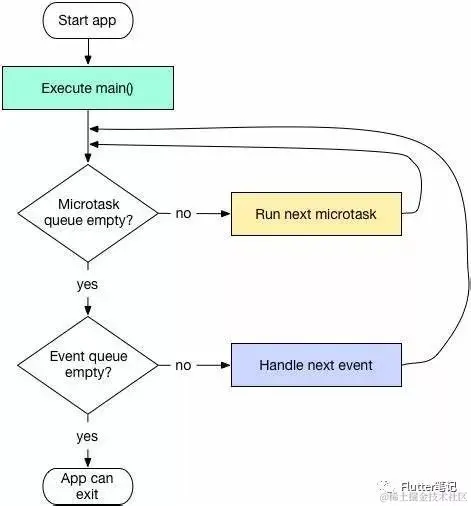

# Dart 语言常用的知识点

## Dart 异步操作 - Futrue

1. **阻塞式调用和非阻塞式调用**
  - 阻塞和非阻塞关注的是程序在等待调用结果（消息，返回值）时的状态。
  - 阻塞式调用： 调用结果返回之前，当前线程会被挂起，调用线程只有在得到调用结果之后才会继续执行。
  - 非阻塞式调用： 调用执行之后，当前线程不会停止执行，只需要过一段时间来检查一下有没有结果返回即可。

2. **Dart 事件循环**
  单线程模型中主要就是在维护着一个事件循环（Event Loop）。

    

  1. 事件循环基本原理

      - 就是将需要处理的一系列事件（包括点击事件、IO事件、网络事件）放在一个事件队列（Event Queue）中。不断的从事件队列（Event Queue）中取出事件，并执行其对应需要执行的代码块，直到事件队列清空位置。

      - 事件循环包含微任务队列（Microtask Queue）和事件队列（Event Queue），dart 从 main 函数开始执行，然后进入事件循环中，优先执行微任务队列中的任务，如果微任务队列没有任务就执行事件队列中的任务，然后以此循环。

  2. 我们来写一个事件循环的伪代码：

      ```dart
      // 这里我使用数组模拟队列, 先进先出的原则
      List eventQueue = []; 
      var event;

      // 事件循环从启动的一刻，永远在执行
      while (true) {
        if (eventQueue.length > 0) {
          // 取出一个事件
          event = eventQueue.removeAt(0);
          // 执行该事件
          event();
        }
      }
      ```

      当我们有一些事件时，比如点击事件、IO事件、网络事件时，它们就会被加入到eventLoop中，当发现事件队列不为空时，就会取出事件，并且执行。

      参考资料：https://zhuanlan.zhihu.com/p/83781258
      参考资料: https://juejin.cn/post/7383281753145475099

3. **Future 的两种状态**
    1. 未完成状态，执行 Future 内部的操作时，例如网络请求过程，延时过程，我们称这个过程为未完成状态
    2. 完成状态，当 Future 内部的操作执行完成，通常会返回一个值，或者抛出一个异常。这两种情况，我们都称 Future 为完成状态。

4. **Future 执行原理**

  - 单个 Future 是如何异步执行的？

    1. 函数执行体放入 `Event Queue`
    2. 外部代码继续执行
    3. 在 Event Queue 中按顺序取出 Event 同步执行相应的操作

  - 多个 Future 是如何异步执行的？

    1. 按照先后顺序依次加入到 Event Queue 中
    2. then 执行体在 Future 执行体完毕后立即执行
    3. 多个 then 执行体按照链式调用有序执行
    4. 如果 Future 执行完毕，后续加入的 then 执行体则加入到微任务队列（Microtask Queue）执行
        - 代码说明:

          ```dart
          void schedule() async {
            Future(() => print('1')).then((value) => print('2'));
            final fx = Future(() => print('3'));
            Future(() => print('4')).then((value) => print('5'));
            fx.then((value) => print('6')); // 后续的 then 执行体已经加入了 Microtask Queue 中
          }
          ```

          打印的顺序是: 1 2 3 6 4 5，由此可见 fx 的 then 方法执行体已经加入到了 Microtask Queue 中优先执行

## Dart 异步操作 - Isolate

1. **Isolate**
  - Isolate 的一些特性
    1. 所有的 Dart 代码都运行在 Isolate 中。Isolate 有自己私有的内存空间和一个运行事件循环的独立线程。
    2. 大部分 Dart 应用在一个 Isolate 中运行全部代码，也可以根据需要创建更多 Isolate。如果某个操作计算量如此之大以至于它在主 Isolate 运行中会导致掉帧，可以使用 Isolate.spawn() 或Flutter’s compute() function 方法。这些方法都会创建独立的 Isolate 来做密集计算，让主 Isolate 专注重建和渲染 Widget 树。
    3. 新创建的 Isolate 有自己的事件循环和内存，原先的 Isolate (即创建新 Isolate 的那个 Isolate) 不能访问这些内存。这种机制正是 Isolate 名字的来源：内存块之间彼此隔离。
    4. 事实上，Isolate 之间能协作的唯一方式是消息传递。一个 Isolate 可以向另一个 Isolate 发送消息，接收方在其事件循环处理收到的消息。
    5. Isolate 中内存分配和垃圾回收不需要锁定。Isolate 中只有一个线程，如果它不是很忙的话，内存并不会快速变化，所以不必锁定。这非常适合 Flutter 应用，它时常要迅速地构建和销毁 Widget 树。
  
  - Isolate 的使用场景
    1. CPU 处理密集型的任务场景中可以使用 Isolate 单独处理，例如图片处理，视频音频处理，文件压缩等。因为它可以在独立的线程中运行，而不会阻塞UI线程。使用 Future 可能会导致UI线程被阻塞，从而影响应用程序的响应性。

    2. 处理大量数据：如果您需要处理大量的数据，例如从网络获取大型数据集，那么使用 Isolate 可以更好，因为它可以在独立的线程中处理数据，而不会阻塞 UI 线程。使用Future可能会导致 UI 线程被阻塞，从而影响应用程序的响应性。

    3. 并行处理多个任务：如果您需要同时处理多个任务，例如同时下载多个文件或同时处理多个图像，那么使用 Isolate 可以更好，因为它可以在独立的线程中同时处理多个任务，而不会阻塞 UI 线程。使用 Future 可能需要串行处理多个任务，从而导致应用程序的响应性变差。

  - Isolate 的基本使用方法:

    1. 使用 `Isolate.spawn` 创建 isolate
      ```dart
      void performWorker() async {
        // 创建一个接收消息的 port
        final receivePort = ReceivePort();
        // 使用 spawn 创建一个 isolate，传入一个需要在线程中传出消息的 port
        final isolate = await Isolate.spawn((sendPort) {
          // 这个回掉中执行耗时操作
          Future.delayed(const Duration(seconds: 1), () {
            sendPort.send('哈哈哈，延时一秒钟');
          });
        }, receivePort.sendPort);

        // 监听耗时操作的结果
        receivePort.listen((message) {
          print('接收到的消息: $message');

          // 关闭 port
          receivePort.close();
          // 销毁 isolate
          isolate.kill();
        });
      }
      ```

    2. 使用 `compute` 函数创建 isolate

      ```dart
      void performWorker() async {
        // 创建一个 isolate，在回掉函数中执行耗时操作并返回结果
        // 第一个泛型参数是回掉函数的参数类型
        // 第二个泛型参数是返回值结果的类型
        final result = await compute<String, int>((message) async {
          await Future.delayed(const Duration(seconds: 1));
          return 1000;
        }, 'https://user/id');
        // 使用结果
        print('result is $result');
      }
      ```
    上述两种方式中，`spawn` 方法创建的 isolate 功能更多，可以实现自定义；使用 `compute` 创建的 isolate 使用非常简单，适合功能单一的场景。
    
    >参考资料：https://cloud.tencent.com/developer/article/1860255

    >参考资料：https://ducafecat.com/blog/flutter-isolate

2. **Isolate 和线程的区别**
  - 线程与线程之间是共享内存的，而 isolate 和 isolate 之间内存是不共享的，所以叫 isolate (隔离)。
  
    >**提示**
      因为 Dart 没有共享内存的并发，没有竞争的可能性所以不需要锁，也就不用担心死锁的问题

3. **Isolate 之间如何传递消息（通信）**
  - 由于 isolate 之间没有共享内存，所以他们之间的通信唯一方式只能是通过 `Port` 进行，而且 Dart 中的消息传递总是异步的。

  - 通信使用: SendPort、ReceivePort

4. **Future 与 Isolate 的区别**

  - Futrue 封装了异步任务，异步任务通过 `await` `async` 关键字，借助事件循环（Event Loop）实现非阻塞调用
  - Isolate 封装了并发任务，有自己的事件循环和内存空间，并发任务通过 `SendPort` 进行单向通信
