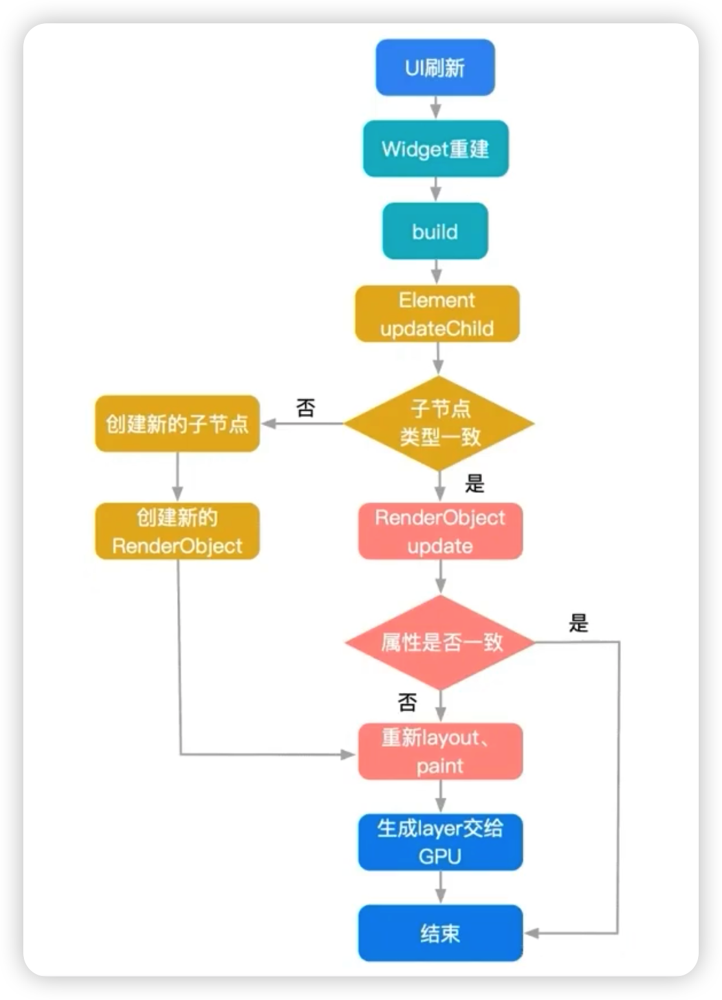
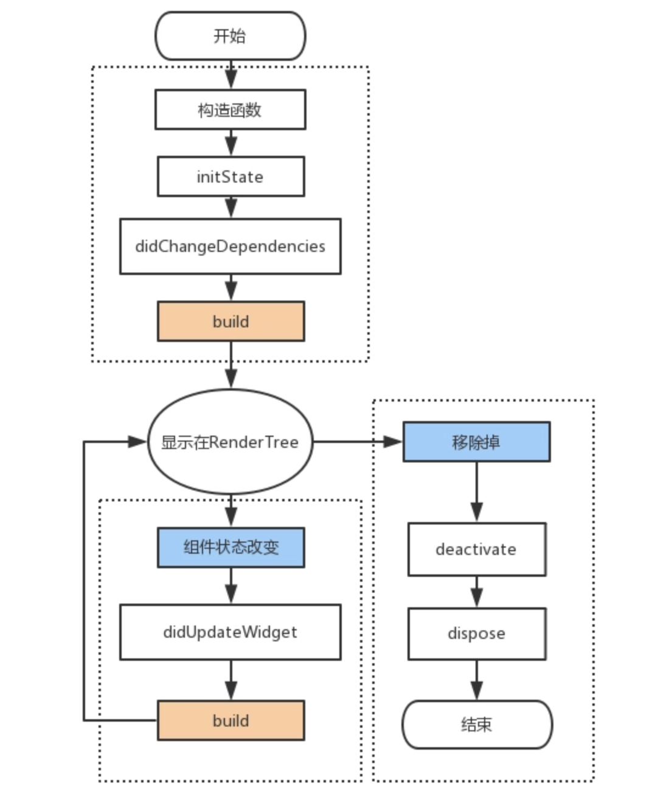

# Flutter 的一些知识点

## Dart 语言知识点

 

## Flutter 知识点

1. **渲染原理**

  - 三棵树简介
    - Widget Tree 部件树
      存放渲染内容、它只是一个配置数据结构，创建是非常轻量的，在页面刷新的过程中随时会重建

    - Element Tree 元素树
      是分离 WidgetTree 和真正的渲染对象的中间层， WidgetTree 用来描述对应的Element 属性, 同时持有 Widget 和 RenderObject，存放上下文信息，通过它来遍历视图树，支撑UI结构。

    - RenderObject 渲染树
      用于应用界面的布局和绘制，负责真正的渲染，保存了元素的大小，布局等信息，实例化一个 RenderObject 是非常耗能的

    - 流程: 当应用启动时 Flutter 会遍历并创建所有的 Widget 形成 Widget Tree，通过调用 Widget 上的 `createElement()` 方法创建每个 `Element` 对象，形成 Element Tree。最后调用 Element 的 `createRenderObject()` 方法创建每个渲染对象，形成一个 Render Tree。
    - Flutter UI 的渲染流程如下图所示
     

  - flutter为什么要设计成这样呢？为什么要弄成复杂的三层结构？
    - 答案是性能优化。如果每一点细微的操作就去完全重绘一遍UI，将带来极大的性能开销。flutter 的三棵树型模式设计可以有效地带来性能提升。

    - widget 的重建开销非常小，所以可以随意的重建，因为它不一会导致页面重绘，并且它也不一定会常常变化。 而renderObject如果频繁创建和销毁成本就很高了，对性能的影响比较大，因此它会缓存所有页面元素，只是当这些元素有变化时才去重绘页面。

    - 而判断页面有无变化就依靠element了，每次 widget 变化时 element 会比较前后两个 widget，只有当某一个位置的 Widget 和新 Widget 不一致，才会重新创建 Element 和 widget；其他时候则只会修改 RenderObject 的配置而不会进行耗费性能的 RenderObject 的实例化工作了。
  
  - 三棵树的作用
    - 简而言之是为了性能，为了复用 Element 从而减少频繁创建和销毁 RenderObject。因为实例化一个 RenderObject 的成本是很高的，频繁的实例化和销毁 RenderObject 对性能的影响比较大，所以当 Widget 树改变的时候，Flutter 使用 Element 树来比较新的 Widget 树和原来的 Widget 树。

    - 如果某一个位置的 Widget 和新 Widget 不一致，才需要重新创建 Element；
    如果某一个位置的 Widget 和新 Widget 一致时(两个 widget 相等或 runtimeType 与 key 相等)，则只需要修改 RenderObject 的配置，不用进行耗费性能的 RenderObject 的实例化工作了；
    因为 Widget 是非常轻量级的，实例化耗费的性能很少，所以它是描述APP的状态（也就是configuration）的最好工具；
    重量级的 RenderObject（创建十分耗费性能）则需要尽可能少的创建，并尽可能的复用；


    >**参考资料**
    https://blog.csdn.net/jdsjlzx/article/details/125397397
  
  - Element 的生命周期
    1. `Mount` 挂载，元素第一次被添加到元素树上的时候就会调用
    2. `Active` 激活之前失活的元素时调用
    3. `Update` 用新数据去更新 RenderObject 的时候调用
    4. `Deactive` 当元素从树中移除或者移动时会被调用。如果一个元素在在同一帧期间被移动了并且设置了 GlobalKey，那么它任然能被激活
    5. `Unmount` 卸载，如果元素在某一帧期间没有被激活，将会被卸载，并且不会再复用

    >提示：如果需要做性能优化，你需要尽可能的让元素使用 `Active` 和 `Update` 操作，并且尽量避免元素出发 `Mount` 和 `Unmount` 操作，使用 GlobalKey 和 Valuekey 可以做到这一点。

2. **组件的生命周期**

  - StatelessWidget 的生命周期

    1. 构造函数
    2. build 函数

  - StatefulWidget 的生命周期如下图所示
    

3. **Flutter App 的生命周期**
  - 使用 `WidgetsBindingObserver` mixin 监听生命周期，重写 `didChangeAppLifecycleState()` 方法来获取。通过该接口可以获取是生命周期状态在 `AppLifecycleState` 枚举中。
  - AppLifecycleState就是App的生命周期，包含四个
    1. `inactive`: App 处于并不活跃的状态，无法处理用户响应
    2. `resumed`: App 可见并能响应用户的输入
    3. `paused`: App 不可见并不能响应用户的输入，但是在后台继续活动中
    4. `detached`: App 进程已经被杀死

    ```dart
    class MyHomePageState extends State<TestPage> with WidgetsBindingObserver {
      @override
      Widget build(BuildContext context) {
    
      }
    
      @override
      void initState(){
        super.initState();

        // 添加监听
        WidgetsBinding.instance.addObserver(this);
      }
    
      @override
      void didChangeAppLifecycleState(AppLifecycleState state) {
        // App 的生命周期回调
        switch (state) {
          case AppLifecycleState.inactive:
            print('app -> inactive');
            break;
          case AppLifecycleState.resumed:
            print('app -> resumed 恢复');
            break;
          case AppLifecycleState.paused:
            print('app -> paused 挂起');
            break;
          case AppLifecycleState.detached:
            print('app -> detached 已经退出(进程已杀死)');
            break;
        }
      }
    }
    ```

    参考资料: http://www.ppmy.cn/news/543.html?action=onClick

3. **如何监听路由跳转**

  1. 让页面混入 `RouteAware` 这么一个 mixin
  2. 在 `initState()` 或者 `didChangeDependencies()` 中添加订阅监听的代码；在 `dispose()` 中添加移除监听的代码

      ```dart
      // 订阅路由事件
      Routes.routeObserver.subscribe(this, ModalRoute.of(context) as PageRoute);

      // 取消订阅
      Routes.routeObserver.unsubscribe(this);
      ```

  3. 重写 `RouteAware` 中的方法
  
      ```dart
      @override
      void didPopNext() {
        super.didPopNext();
        print('didPopNext');
      }

      @override
      void didPushNext() {
        super.didPushNext();
        print('didPushNext');
      }
      ```

4. **监听 FlutterView 的尺寸变化**
  - 这个监听常用作监听键盘弹出或隐藏
  - 如何使用
    1. 当前 Widget 混入 一个 mixin `WidgetsBindingObserver`
    2. initState() 中添加监听，dispose() 中移除监听

        ```dart
        WidgetsBinding.instance.addObserver(this);
        WidgetsBinding.instance.removeObserver(this);
        ```
    3. 在 `didChangeMetrics()` 方法中添加 frame 变化的监听
        
        ```dart
        @override
        void didChangeMetrics() {
          super.didChangeMetrics();

          // 监听 FlutterView 尺寸变化
          WidgetsBinding.instance.addPostFrameCallback((t) {
            final viewInsets = MediaQuery.of(context).viewInsets;
            if (viewInsets.bottom > 0) {
              // 键盘弹出
              print('键盘弹出来了');
            }
          });
        }
        ```

5. **Isolate**
  - Isolate 的一些特性
    1. 所有的 Dart 代码都运行在 Isolate 中。Isolate 有自己私有的内存空间和一个运行事件循环的独立线程。
    2. 大部分 Dart 应用在一个 Isolate 中运行全部代码，也可以根据需要创建更多 Isolate。如果某个操作计算量如此之大以至于它在主 Isolate 运行中会导致掉帧，可以使用 Isolate.spawn() 或Flutter’s compute() function 方法。这些方法都会创建独立的 Isolate 来做密集计算，让主 Isolate 专注重建和渲染 Widget 树。
    3. 新创建的 Isolate 有自己的事件循环和内存，原先的 Isolate (即创建新 Isolate 的那个 Isolate) 不能访问这些内存。这种机制正是 Isolate 名字的来源：内存块之间彼此隔离。
    4. 事实上，Isolate 之间能协作的唯一方式是消息传递。一个 Isolate 可以向另一个 Isolate 发送消息，接收方在其事件循环处理收到的消息。
    5. Isolate 中内存分配和垃圾回收不需要锁定。Isolate 中只有一个线程，如果它不是很忙的话，内存并不会快速变化，所以不必锁定。这非常适合 Flutter 应用，它时常要迅速地构建和销毁 Widget 树。
  
  - Isolate 的使用场景
    1. CPU 处理密集型的任务场景中可以使用 Isolate 单独处理，例如图片处理，视频音频处理，文件压缩等。因为它可以在独立的线程中运行，而不会阻塞UI线程。使用 Future 可能会导致UI线程被阻塞，从而影响应用程序的响应性。

    2. 处理大量数据：如果您需要处理大量的数据，例如从网络获取大型数据集，那么使用 Isolate 可以更好，因为它可以在独立的线程中处理数据，而不会阻塞 UI 线程。使用Future可能会导致 UI 线程被阻塞，从而影响应用程序的响应性。

    3. 并行处理多个任务：如果您需要同时处理多个任务，例如同时下载多个文件或同时处理多个图像，那么使用 Isolate 可以更好，因为它可以在独立的线程中同时处理多个任务，而不会阻塞 UI 线程。使用 Future 可能需要串行处理多个任务，从而导致应用程序的响应性变差。

  - Isolate 的基本使用方法:

    1. 使用 `Isolate.spawn` 创建 isolate
      ```dart
      void performWorker() async {
        // 创建一个接收消息的 port
        final receivePort = ReceivePort();
        // 使用 spawn 创建一个 isolate，传入一个需要在线程中传出消息的 port
        final isolate = await Isolate.spawn((sendPort) {
          // 这个回掉中执行耗时操作
          Future.delayed(const Duration(seconds: 1), () {
            sendPort.send('哈哈哈，延时一秒钟');
          });
        }, receivePort.sendPort);

        // 监听耗时操作的结果
        receivePort.listen((message) {
          print('接收到的消息: $message');

          // 关闭 port
          receivePort.close();
          // 销毁 isolate
          isolate.kill();
        });
      }
      ```

    2. 使用 `compute` 函数创建 isolate

      ```dart
      void performWorker() async {
        // 创建一个 isolate，在回掉函数中执行耗时操作并返回结果
        // 第一个泛型参数是回掉函数的参数类型
        // 第二个泛型参数是返回值结果的类型
        final result = await compute<String, int>((message) async {
          await Future.delayed(const Duration(seconds: 1));
          return 1000;
        }, 'https://user/id');
        // 使用结果
        print('result is $result');
      }
      ```
    上述两种方式中，`spawn` 方法创建的 isolate 功能更多，可以实现自定义；使用 `compute` 创建的 isolate 使用非常简单，适合功能单一的场景。
    

  参考资料：https://cloud.tencent.com/developer/article/1860255
  参考资料: https://ducafecat.com/blog/flutter-isolate

6. **Isolate 和鲜线程的区别**
  - 线程与线程之间是共享内存的，而 isolate 和 isolate 之间是不共享的，所以叫 isolate (隔离)。
  
    >**提示**
      因为 Dart 没有共享内存的并发，没有竞争的可能性所以不需要锁，也就不用担心死锁的问题

7. **Isolate 之间如何传递消息（通信）**
  - 由于 isolate 之间没有共享内存，所以他们之间的通信唯一方式只能是通过 `Port` 进行，而且 Dart 中的消息传递总是异步的。

  - 通信使用: SendPort、ReceivePort

8. **Flutter 中与原生代码交互的三种方式**

    1. `MethodChannel` 用于传递方法调用（method invocation）通常用来调用 native 中某个方法。
    2. `BasicMessageChannel` 用于传递字符串和半结构化的信息，这个用的比较少。
    3. `EventChannel` 用于数据流（event streams）的通信。有监听功能，比如电量变化之后直接推送数据给 flutter 端。

    参考资料： https://juejin.cn/post/7035211019618091045

9. **阻塞式调用和非阻塞式调用**
  - 阻塞和非阻塞关注的是程序在等待调用结果（消息，返回值）时的状态。
  - 阻塞式调用： 调用结果返回之前，当前线程会被挂起，调用线程只有在得到调用结果之后才会继续执行。
  - 非阻塞式调用： 调用执行之后，当前线程不会停止执行，只需要过一段时间来检查一下有没有结果返回即可。

10. **Dart 事件循环**
  单线程模型中主要就是在维护着一个事件循环（Event Loop）。

  1. 事件循环基本原理
    就是将需要处理的一系列事件（包括点击事件、IO事件、网络事件）放在一个事件队列（Event Queue）中。不断的从事件队列（Event Queue）中取出事件，并执行其对应需要执行的代码块，直到事件队列清空位置。
  2. 我们来写一个事件循环的伪代码：

      ```dart
      // 这里我使用数组模拟队列, 先进先出的原则
      List eventQueue = []; 
      var event;

      // 事件循环从启动的一刻，永远在执行
      while (true) {
        if (eventQueue.length > 0) {
          // 取出一个事件
          event = eventQueue.removeAt(0);
          // 执行该事件
          event();
        }
      }
      ```

      当我们有一些事件时，比如点击事件、IO事件、网络事件时，它们就会被加入到eventLoop中，当发现事件队列不为空时，就会取出事件，并且执行。

      参考资料：https://zhuanlan.zhihu.com/p/83781258

11. **Future 的两种状态**
    1. 未完成状态，执行 Future 内部的操作时，例如网络请求过程，延时过程，我们称这个过程为未完成状态
    2. 完成状态，当 Future 内部的操作执行完成，通常会返回一个值，或者抛出一个异常。这两种情况，我们都称 Future 为完成状态。

12. **BuildContext 是什么**
  - 根据官方的注释，我们可以知道 BuildContext 实际上就是 `Element` 对象，主要是为了防止开发者直接操作 Element 对象。通过源码我们也可以看到 Element 是实现了 BuildContext 这个抽象类中的接口，那么在当前 Widget 中获取到 context 就可以获取到 Element 的一些信息。如下所示代码：

    ```dart
    // 系统中 Element 抽象类实现了 BuildContext 抽象类的接口
    abstract class Element extends DiagnosticableTree implements BuildContext {
      // 这里是 Element 抽象类的一些代码 ...
    }
    ```

  - Element 是 Widget 树中特定位置所对应的实例，Widget 的状态都会保存在 Element 当中。那么 BuildContext 到底能干什么呢？只要是 Element 能做的事情，BuildContext 基本都能做，如：

    ```dart
    final size = context.size;
    final render = context.findRenderObject();
    // 还有很多请自行查阅 BuildContext ....
    ```
  - 还可以使用 Element 的 `markNeedsBuild()` 方法刷新状态（不推荐），如下所示

    ```dart
    (context as Element).markNeedsBuild();
    ```

    这就是 `setState()` 方法中最核心的代码，在 markNeedsBuild 方法中会将当前 element 标记为 `脏`（_dirty = true），然后会调用 `owner.scheduleBuildFor(this);` 方法执行刷新状态。

    setState 刷新很复杂，请参考: https://juejin.cn/post/7044865304647696391

13. **Flutter 布局的核心机制**
  - Flutter 布局的核心机制是 `widgets`。在 Flutter 中，几乎所有东西都是 widget，甚至布局模型都是 widgets。你在 Flutter 应用程序中看到的图像，图标和文本都是 widgets。此外不能直接看到的也是 widgets，例如用来排列、限制和对齐可见 widgets 的行、列和网格。

14. **松约束和紧约束**
  - 松约束：约束最小值为 0 `minWidth 和 minHeight` 的约束
  - 紧约束：约束最小值不为 0，最小值和最大值相同
  - 如果约束最小值为 0，切最大值也为 0，这个约束同时是松约束和紧约束

    例如：Center 就是松约束组件，值的范围 0.0 >= w <= max

  - 约束最大值没有指定就是`无界（unbounded）`，指定了约束最大值就是`有界（bounded）`

  使用 `LayoutBuilder` 组件查看当前的约束，使用 `ConstrainedBox` 组件精准的设置约束

15. **Column 布局的步骤**
  - 先布局没有弹性的组件，然后再布局有弹性的组件

    ```dart
    Column(
      children: [
        const SizedBox(height: 10,),
        ListView(
          children: [
            for (var i = 0; i < 10; i++)
              Text('测试数据 $i'),
          ],
        ),
        const SizedBox(height: 20,),
      ],
    )
    ```
    上述代码在布局的时候，ListView 没有指定大小，会默认为无边界，所以 Column 在布局的时候会发现 ListView 无法布局，所以就会报错。Column 的高度减去 ListView 的高度是一个负数，ListView 的高度为 `double.infinity`。

    可以在 ListView 包裹一层弹性布局，例如: `Expanded` 或者 `Flexible`，这两个弹性组件会充满 Column 剩余的空间，所以 ListView 的尺寸就得到了自适应。

16. **MainAxisAlignment 枚举的含义**
  这是一个 Column 或者 Row 组件中布局用到的主轴排列方式

  1. spaceEvenly: 平均分陪剩下的空间
  2. spaceBetween: 把剩余的空间插入中间的组件当中，两边没有空间
  3. spaceAround: 每个组件左右或者上下都有相等的空间

17. **Flutter 布局约束的规则**
  - 首先：上层 widget 向下层 widget 传递约束条件
  - 然后：下层 widget 向上层 widget 传递大小信息
  - 最后：上层 widget 决定下层 widget 的位置。

18. **Stack 布局的规则**
  - Stack 优先布局没有位置的组件，Stack 的大小由没有位置的组件中最大的一个组件决定，然后在布局有定位的组件（使用 Positioned 包裹的组件）。
  - 如果 Stack 中全是 Positioned 定位组件，Stack 的尺寸就是最大。

  - Stack 中的 `fit` 属性：
    1. `StackFit.loose` 将父组件的约束变宽松，让子组件的尺寸在自己的范围内变化
    2. `StackFit.expand` 将 Stack 组件的尺寸变得和父组件一样大
    3. `StackFit.passthrough` 直接让 Stack 的父组件的约束传递给 Stack 的子组件
  - clipBehavior 属性，默认 `hardEdge`，溢出就裁切边沿部分，可以设置成 `Clip.none` 不裁切

19. **Container 的默认尺寸**

    1. 不存在 child 的情况，首先在结合父组件传递的约束和 Container 自身的width, height, constraints 属性计算约束
      - 如果计算出来的约束时有界的，则尽量占满
      - 如果计算出来的约束时无界的，则尽量缩小 常见的无边界的组件有 Row(水平无边界) 和 Column(垂直无边界)

    2. 存在 child 的情况，首先将父组件传递的约束和 Container 自身的width, height, constraints 约束传递给子组件，子组件可以确定自身的尺寸
      - 如果没有设置对齐（alignment）方式的请情况下，Container 会尽可能的小，以便匹配 child 的尺寸
      - 如果设置了对齐（alignment）方式，但是某个纬度的约束无界，Container 还是在会无界约束的维度尽可能的小，以便匹配 child 的尺寸
      - 如果设置了对齐（alignment）方式，约束是有界的，Container 会尽可能的放大，为对齐方式创造条件
      
20. **Container 的本质**
  - Container 是一个结合了尺寸，形状，背景颜色，间距，留白，约束，装饰等功能于一身的组件，以属性的方式设置对应的值，这样就不需要层层嵌套。

  - Container 中各种属性所对应的组件：
    - 存在 padding、margin 就会将 child 包裹一层 `Padding` 组件
    - 存在 alignment 就包裹一层 `Align` 组件
    - 存在 color 就包裹一层 `ColoredBox` 组件
    - 存在 clipBehavior 就包裹一层 `ClipPath` 组件
    - 存在 decration、foregroundDecoration 就包裹一层 `DecoratedBox` 组件
    - 存在 constraints 就包裹一层 `ConstrainedBox` 组件
    - 存在 transform 就包裹一层 `Transform` 组件

21. **LimitedBox 是什么**
  - 当其自身不受约束时才限制其大小的盒子。
  - 如果受到了约束限制，其中的 maxWidth 和 maxHeight 不起作用。

  - 例如在 Container 的源代码 build 方法中，可以看到当 Container 没有子组件并且没有设置约束或者不是紧约束，就展示一个 LmitedBox，代码如下:
      ```dart
      if (child == null && (constraints == null || !constraints!.isTight)) {
        current = LimitedBox(
          maxWidth: 0.0,
          maxHeight: 0.0,
          child: ConstrainedBox(constraints: const BoxConstraints.expand()),
        );
      }
      ```
    上述代码中，LimitedBox 收到约束影响，maxWidth、maxHeight 就不起作用，就会展示 child 的 ConstrainedBox 组件，ConstrainedBox 组件的约束是 expand，expand 方法中默认值是 double.infinity，此时 child 就会充满父组件。
