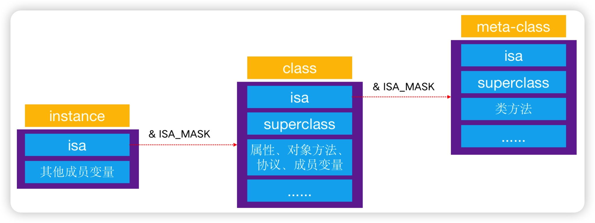
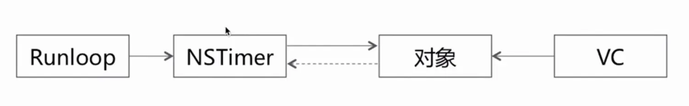

# iOS 技术面试问题总结

总结一些在求职经历中的遇到的一些面试问题

## Swift 和 Objc

1. **什么是逃逸闭包和非逃逸闭包**
    - 逃逸闭包：当闭包作为⼀个实际参数传递给⼀个函数的时候，并且是在函数返回之后调⽤，我们就说这个闭包逃逸了。当我们声明⼀个接受闭 包作为形式参数的函数时，你可以在形式参数前写 `@escaping` 来明确闭包是允许逃逸的。
    - 非逃逸闭包：闭包调用发生在函数结束之前，闭包调用在函数作用域内。

2. **OC 中属性 nonatomic 和 atomic 的区别**
    - nonatomic 为非原子性，不是线程安全的
    - atomic 叫做原子操作，其本质是在属性的 getter 与 setter 方法内部添加了 `pthread_mutex` 普通同步锁，它并不能保证使用属性的过程是线程安全的。由于atomic的加锁解锁需要消耗额外的cpu资源并不推荐使用。我们在使用属性的时候可以使用多线程同步技术来保证属性的线程安全即可。

3. **Swift 中类和结构体的区别**
    - 类有继承，结构体没有继承，所以也就没有重写、多态等特性
    - 类比结构体复杂，类编译后的汇编代码比结构体多，所以，结构体的运行效率要比类快一点。
    - 结构体的一些属性默认是不能被改变的，如果需要在方法中改变，可以选择在 func 关键字前加上 `mutating` 关键字来指定实例方法内可以修改属性
    - 类中的每一个成员变量都必须被初始化，否则编译器会报错，而结构体不需要，编译器会自动帮我们生成init函数，给变量赋一个默认值

      >**提示**
      一些明确的类，结构简单，就只放些属性和方法，没有继承啥的，建议使用结构体代替类。
4. **Swift 中的值类型和引用类型的区别**
    - 值类型，存放在栈区；引用类型存在在堆区
    - 值类型的赋值为`深拷贝`，即新对象和源对象是独立的，当改变新对象的属性，源对象不会受到影响，反之同理。
      引用类型的赋值是`浅拷贝`，即新对象和源对象的变量名不同，但其引用（指向的内存空间）是一样的，因此当使用新对象操作其内部数据时，源对象的内部数据也会受到影响。
    - 一句话总结：深拷贝就是内容拷贝，浅拷贝就是指针拷贝。本质区别在于：是否开启新的内存地址,是否影响内存地址的引用计数

5. **Swift 中值类型和引用类型的数据类型**
    - 值类型：整型 浮点型 字符串 元组 数组 字典 集合 结构体
    - 引用类型：类 闭包

6. **OC中的深拷贝和浅拷贝**
    - 深拷贝：拷贝前后两个对象是独立的，改变其中一个对象的值，另一个对象不受干扰。
    - 浅拷贝：拷贝前后的两个对象都指向同一个对象，只复制了对象的地址，使原对象的引用计数+1，修改其中一个对象的值，另一个对象也会改变。

7. **OC 中的 copy 和 mutableCopy**
    - `copy`：当不可变对象调用 copy，生成的对象还是不可变对象，属于浅拷贝；可变对象调用 copy，生成的是不可变对象，属于深拷贝。
    - `mutableCopy`：无论是可变或者不可变对象调用 mutableCopy，生成的对象都是可变对象，都是属于深拷贝
8. **OC 中 NSString 为什么使用 copy 定义属性而不是 strong**
    - NSString 使用 copy 和 strong 都可以定义属性，如果给这个属性赋值的是一个 NSString 对象是没什么影响的，如果使用 strong 定义属性，赋值对象是一个 NSMutableString 就会有影响，当 NSMutableString 对象中的值发生改变的时候，属性中的值也会发生改变，这是因为属性 NSString 直接指向了一个 NSMutableString 的对象。如果使用 copy 则不会有什么影响，copy 对于 NSMutableString 来说是属于深拷贝，拷贝结果是一个不可变对象（NSString），正好符合 NSStirng 不可变的初衷。
9. **OC 中使用 copy 修饰 NSMutableString 会发生什么**
    - 修改内容的时候会发生崩溃，因为 copy 对于 NSMutableStirng 是属于深拷贝，返回的是一个 NSString 类型对象（不可变对象），如果对这个 NSMutableString 所指的对像进行修改就会发生崩溃。

10. **weak 和 assgin 的区别**
    - `weak` 只能修饰对象，`assgin` 即可修饰对象也可修饰基本数据类型
    - `weak` 修饰的对象被释放之后会自动设置成 nil，所以是安全的；而 `assgin` 修饰的对象被释放之后不会自动设置成 nil，会产生也指针，所以不安全。 
11. **weak 的实现原理概括**
    - runtime 维护了一个 weak 表，用于存储指向某个对象的所有weak指针。weak 表其实是一个 hash（哈希）表，Key 是所指对象的地址，Value 是 weak 指针的地址数组（这个地址的值是所指对象的地址）。
    - 在对象被回收的时候，首先根据对象地址获取所有 Weak 指针地址的数组，然后遍历这个数组，把每个地址存储的数据设为 nil ，最后把这个 key-value entry 从 Weak 表中删除。

    - 实现原理可以概括以下三步：
      1. 初始化时：runtime 会调用 objc_initWeak 函数，初始化一个新的weak指针指向对象的地址。
      2. 添加引用时：objc_initWeak 函数会调用 objc_storeWeak() 函数， objc_storeWeak() 的作用是更新指针指向，创建对应的弱引用表。
      3. 释放时，调用 clearDeallocating 函数。clearDeallocating 函数首先根据对象地址获取所有weak指针地址的数组，然后遍历这个数组把其中的数据设为nil，最后把这个 entry从weak 表中删除，最后清理对象的记录。

    - 为什么在对象释放之后，使用 weak 修饰的对象会自动设置成 nil
      1. 因为在对象销毁后，会调用 dealloc 方法。
      2. 在 dealloc 内部方法实现中，会调用 `weak_clear_no_lock()` 函数。
      3. 在该函数内部，会根据当前对象指针，利用哈希算法，查找弱引用表，然后取出弱引用数组，遍历这个数组，将弱引用指针全部置为nil。


12. **OC 中 block 的本质**
    - block 本质上是一个 Objc 对象，它内部也有 isa 指针，这个对象封装了函数的调用地址(函数指针)以及函数调用的环境（函数参数、返回值、捕获的外部变量等）。

    - 如下所示 block 的源码实现:

        ```c
        // block类的结构体指针，每个block的这个都是相同的，存储一些block常用的标识等等
        struct __block_impl {
            void *isa;      // 指向所属类的指针，也就是 Block 类型，参考OC的self指针
            int Flags;      // 标志变量，在实现 block 的内部操作时会用到
            int Reserved;   // 保留变量
            void *FuncPtr;  // block 执行时调用的函数指针，其指向block代码块中的地址
        };
        ```
    
11. **block 存放在哪里，分为几种**
    - data 区
    - 栈区
    - 堆区

    按存储区域可以分为三种 block, 分别是 全局 block, 栈 block，堆 block。
    
    - 全局 block 存放在 data 区，类名 `__NSGlobalBlock__`，block 不使用**外部的局部变量**或者只有当block里面仅仅捕获了外部的**静态局部变量**、**全局变量**、**静态全局变量**时就变成全局 block，堆全局 block 做 copy 操作还是全局 block。
    - 栈 block 存放在栈区，类名 `__NSStackBlock__`，使用了外部的局部变量的 block 刚创建出来没有复制给任何变量，也没有做 copy 操作就是栈 block。如果创建出来的 block 使用了外部局部变量，然后将这个 block 赋值给一个使用 `__weak` 修饰的变量，该 block 也是一个栈 block。
    - 堆 block 存放在堆区，类名 `__NSMallocBlock__`，block 创建出来赋值给一个变量并且使用了外部的变量，或者做了 copy 操作就变成了堆block。

      三种 block 的代码演示如下：

      ```c
      // 全局 block
      void (^globalBlock)(void) = ^() {
          NSLog(@"hahah");
      };
      NSLog(@"%@", [globalBlock class]);
      
      // 对全局 block 进行 copy 还是全局 block
      NSLog(@"%@", [[globalBlock copy] class]);
      
      // 堆 block，赋值的时候自动 copy
      NSInteger count = 0;
      void (^mallocBlock)(void) = ^() {
          NSLog(@"%ld", count);
      };
      
      NSLog(@"%@", [mallocBlock class]);
      
      // 栈 block ，block 创建出来没有赋值或者 copy
      __block NSInteger num = 0;
      NSLog(@"%@", [^{
          NSLog(@"%ld", num ++);
      } class]);
      
      // 栈 block，block 创建出来赋值给一个 __weak 修饰的变量，不会 copy 到堆区
      __weak void (^weakBlock)(void) = ^() {
          NSLog(@"%ld", count);
      };
      NSLog(@"%@", [weakBlock class]);
      ```
11. **block 中如何修改局部变量**
    - 在局部变量前面使用 `__block` 修饰

12. **__block 的实现原理**
    - __block 在底层是一个结构体，如下所示
    
      ```objc
      __block int i = 0;
 
      // __block 结构体 
      struct __Block_byref_i_0 {
        void *__isa;  // isa指针
        __Block_byref_i_0 *__forwarding; // 该指针指向自身
        int __flags;  // 标记
        int __size;   // 大小
        int i;        // 变量值
      };
      ```

    - 系统将带有 __block 的变量转换成一个前缀为 `__Block_byref_` 结构体。并且当 block 被 copy 到堆上的时候，一并把 __block 变量的结构体也 copy 一份到堆中。其中堆中 block 结构体的 `__forwarding` 指针指向其变量本身。 这样  block 里面就能截获到 __block 变量的结构体里面的 `__forwarding` 指针，而该指针指向了堆上 __block 变量。这样 block 就能对该变量进行修改了。

13. **block 中的循环引用**
    - 当 block 作为一个对象属性的时候，当前对象会持有 block，然后又在 block 中使用(持有)当前对象，这样就造成两个对象互相持有，这就是 block 中的循环引用。
    
    如何打破循环引用？

    - 让其中一个对象声明成为一个弱引用，使用 `__weak` 修饰。

14. **__weak 是什么**
    - `__weak` 是一个弱引用 

    如何使用：声明一个变量/对象的时候，在前面添加 __weak。
    >**注意**
    弱引用指针不能直接指向创建对象时向堆申请的空间, 只能间接指向一个强引用的空间地址, 间接使用该对象。
15. **__strong 是什么**
    - `__strong` 强引用；相当于声明一个局部变量, 在 block 使用完之后才会释放。也就是说保证在 block 调用完之前, 对象不会被释放。

16. **KVO 和 KVC 是什么**
    - KVO 键值监听，提供了观察某一个属性变化的方法
    - KVC 键值编码，通过字符串去访问或者修改一个属性的值

17. **OC 中 KVO 的原理是什么**
    - KVO 基于 runtime 实现
    - 当一个对象执行 addObserver 之后，对象指向父类的指针 isa 变成了指向一个新的类 `NSKVONotifying_XXX`，当一个类 Person 有一个属性叫 name，Person 类的对象的 name 属性发生改变的时候，`NSNotifying_Person` 的 setName 方法里面调用 [super setName:] [self willChangeValueForKey:@"name"] [self didChangeValueForKey:@"name"]，后面的这个两个方法中会调用监听者内部的 `observeValueForKeyPath` 方法。

    >**参考资料**
    https://juejin.cn/post/6939858821581897741

18. **OC 中 KVC 的原理是什么**
    ```objc
        Person *p = [[Person alloc] init];
        [p setValue:@"Tom" forKey:@"name"];
        [p valueForKey:@"name"];
    ```
    - 如上述代码：

        1. 首先查找一个对象中和 key 相对应的 setter 或者 getter 方法，有就直接调用
        2. 不存在 setter 或者 getter 方法，就查找是否存在以 `_`开头的成员变量 _key，有就访问
        3. 不存在 `_` 开头的成员变量 _key 就查找是否存在这个属性 key，有就直接使用
        4. 不存在这个属性 key，就调用 `setValue: forUndefineKey:` 或者 `valueForUndefineKey:` 方法抛出异常

19. **OC 中的 isa 指针**
    - isa 指针在类中的示意图
    

    - 上图可以得出：
        1. 实例对象的 isa 指向 class 对象。
        2. 当调用对象方法时，通过实例的 isa 找到 class，最后找到对象方法的实现进行调用。
        3. class 对象的 isa 指向 `meta-class` 对象
        4. 当调用类方法时，通过 class 的 isa 找到 `meta-class`，最后找到类方法的实现进行调用。

        >**得出结论**
            1. 实例对象的 isa 指向 class 对象。
            2. class 对象的 isa 指向 meta-class 对象。
            3. meta-class 对象的 isa 指向基类的 meta-class 对象。
            4. 类对象中的 isa 指向类结构被称作 meta-class，meta-class 存储类的 static 类成员变量与 static 类方法（+ 开头的方法）。
            5. 实例对象中的 isa 指向类结构称作 class（普通的），class 结构存储类的成员变量与对象方法（- 开头的方法）。

        参考地址: https://blog.csdn.net/weixin_38633659/article/details/124544684

    - 实例对象调用方法的轨迹：通过 isa 获取 class 对象，找到对象方法调用，如果方法不存在，就通过 superclass 找父类，直到找到止。如果是在找不到就会报错崩溃: `unrecognized selector sent to instance 0x600000209320`

20. **OC 对象 superClass 指针**
    - class 对象的 superclass 指向父类的 class 对象，如果没有父类，superclass 指针为 nil。
    - meta-class 对象的 superclass 指向父类的 meta-class 对象
    - 基类的 meta-class 对象的 superclass 指向基类的 class 对象

21. **OC 中 meta-class 对象的 superclass 指针**
    - meta-class 元类，存储了一个类的所有类方法。每个类的元类都是独一无二的，因为每个类都有一系列独特的类方法。
    - class 对象调用类方法的轨迹：isa 找 meta-class 对象，方法不存在，就通过 superclass 找父类，一直找到基类的meta-class 对象，如果还没有找到，继续通过 superclass 指向基类的class对象。直到找到为止。

21. **分类(Categroy)和扩展(Extension)的区别**
    - 分类有名字，扩展则没有
    - 分类只能扩展方法，扩展既能扩展属性又能扩展方法
    - 分类扩展的方法外部可见，扩展中的方法和属性都是私有的
    - 分类中添加的方法如果和当前类中的方法一样，则会覆盖掉当前类的中这个方法；
    - Extension 是在编译后合并到类中。Category 是runtime 运行时 合并到类中。
    
        >**拓展**
        如果分类中声明了一个属性，那么分类只会生成这个属性的 set、get 方法声明，也就是不会有实现，使用这个属性会报错

22. **分类(Category)中如何扩展属性**
    - 使用 runtime 的 `objc_setAssociatedObject` `objc_getAssociatedObject` 关联对象和获取关联对象两个函数实现。objc_setAssociatedObject 是将一个对象关联到另一个对象上，objc_getAssociatedObject 通过 key 获取被关联的对象值。
        ```c
        // object: 关联者对象
        // key: objc_getAssociatedObject 函数会通过这个 key 值获取被关联者对象
        // value: 被关联者对象
        // policy: 关联时采用的协议，有 assign，retain，copy 等协议
        void objc_setAssociatedObject(id _Nonnull object, const void * _Nonnull key, id _Nullable value, objc_AssociationPolicy policy)

        // object：关联者对象
        // key objc_setAssociatedObject 函数被关联设置的 key
        id _Nullable objc_getAssociatedObject(id _Nonnull object, const void * _Nonnull key)
        ```

    - 如下所示

        ```objc
        @interface Person (Cate)
        @property (nonatomic, assign) double height;

        @end

        @implementation Person (Cate)

        - (void)setHeight:(double)height {
            objc_setAssociatedObject(self, _cmd, @(height), OBJC_ASSOCIATION_ASSIGN);
        }

        - (double)height {
            return [objc_getAssociatedObject(self, @selector(setHeight:)) doubleValue];
        }

        @end
        ```

        上面代码中 `_cmd` 就是当前方法的 `SEL` 指针，这个两个函数需要通过一个 key 去存值和取值，key 是一个 `void *` 无类型指针，所以这里使用当前方法的 SEL 指针最合适不过了（既优雅又实用）。

23. **分类的底层实现原理**
    - 分类的作用：为已经存在的类添加方法，使模块化，组件化（不同功能不同的分类）。可以在不修改原来类的基础上，为一个类 扩展方法。 最主要的应用：给系统自带的类扩展方法。
    - 底层原理
        Category 的本质是一个 `_category_t` 结构体，其结构如下：

        ```c
        struct _category_t {
            const char *name;       // 名称
            struct _class_t *cls;   // 类 
            const struct _method_list *instance_methods;    // 对象方法列表
            const struct _method_list *class_methods;       // 类方法列表
            const struct _protocol_list_t *protocols;       // 协议列表
            const struct _prop_list_t *properties;          // 属性列表
        }
        ```
    - Categroy 的加载过程 
        1. 在编译时只是一个包含**类名**，**类指针**，**方法列表**，**属性列表**，**协议列表**的_category_t结构体；

        2. 在运行时通过 runtime 加载分类数据，把分类的方法、属性、协议数据合并到一个大数组中，后参与编译的分类会在数组的前面(i–倒数遍历数组添加的)（这也说明了分类中相同的方法后参与编译的分类会被调用）；

        3. 合并后的分类数据会插入到原来类数据的前面（相同的方法，分类会优先于原来调用）。

        4. 编译顺序是可以手动设置的：TARGETS->BuildPhases->Complle Sources。（自己可以验证一下，这里不再赘述）

    参考资料：https://zhuanlan.zhihu.com/p/104833029


24. **OC 中调用 Swift 代码**
    1. Swift 类必须继承 NSObject 类，并且 class 关键字前面必须加上 `@objc` 或者 `@objcMembers`
        >**注意**
        class 前面使用 @objc ，在对应的方法或者属性也需要使用 @objc，而 @objcMembers 则不需要
    2. 在对应的 Objc 文件中添加头文件，头文件一般都是 `工程名-Swift.h` 的形式
    3. 在 Objc 代码中按照 Objc 的风格使用。
    >**温馨提示**
    在 Swift 中，继承自 NSObject 的类如果有比较多的属性或方法都需要加上 `@objc` 的话，会多比较多的代码。那么可以利用 `@objcMembers` 减少代码。被 `@objcMembers` 修饰的类，会默认为类、子类、类扩展和子类扩展的所有属性和方法都加上 @objc 。当然如果想让某一个扩展关闭 @objc，则可以用 `@nonobjc` 进行修饰。


25. **@objc 与 @objcMembers 的区别**
    - 在Swift中，继承自 NSObject 的类如果有比较多的属性或方法都需要加上 `@objc` 的话，会多比较多的代码。那么可以利用 `@objcMembers` 减少代码。
    - 被 @objcMembers 修饰的类，会默认为类、子类、类扩展和子类扩展的所有属性和方法都加上 @objc。
    - 如果想让某一个扩展关闭 @objc，则可以用 `@nonobjc` 进行修饰。

26. **自动释放池**
    - release 可能会导致对象立即释放，如果频繁对对象进行 release，可能会造成琐碎的内存管理负担。autorelease 可以将release 的调用延迟到自动释放池被释放时。
    - 推荐使用自动释放池（Autorelease Pool）Block，当期结束时，所有接受autorelease消息的对象将会被立即释放（即发送 release 消息）
    - AppKit 和UIKit 框架在处理每一次事件循环迭代时，都会将其放入一个 Autorelease Pool 中。大多数情况，开发人员无需处理。

27. **什么时候需要手工管理 Autorelease Pool**
    - 编写的程序不基于UI框架，如命令行程序
    - 在循环中创建大量临时对象，需要更早地释放，避免临时对象聚集导致内存峰值过大
    - 在主线程之外创建新的线程，在新线程开始执行处，需要创建自己的 Autorelease Pool
    - 可以嵌套使用 Autorelease Pool

28. **Swift String 和 NSString 的区别**
    String 保留了大部分 NSString 的 API，但是 String 的总体功能来看还是比NSString要更加强大，下面总结了几点区别:

    - String 是值类型，NSString 是引用类型。
    - String 字符串之间的拼接比 NSString 方便
        ```objc
        NSString  *strA  = @ "My name";
        NSString  *strB  = @ " is dsx";
        strA  = [ strA stringByAppendingString: strB];
        ```

        ```swift
        let string = "My name" + " is tom"
        ```

    - String 可以实现字符串遍历
        ```swift
        for ch in "My name is tom" {
            print(ch)
        }
        ```
    - 计算字符串的长度不同，String 使用 `count`，NSString 使用 `length`
    - String 没有将数字字符串转换成数字的 API，NSSrtring 自带 `integerValue`，`doubleValue`，Swift 想要将数字字符串转换成数字，必须使用对应类型数字的构造函数，例如:
        ```swift
        if let value = Int("190") {
            print(value)
        }
        ``` 
29. **代理和 block 传值的优缺点**
    - block 的代码可读性更好。因为应用 block 和实现 block 的地方在一起。代理的声明和实现是分开在两个类中。代理使用起来也更麻烦，因为要声明协议、声明代理、遵守协议、实现协议里的方法。block不需要声明，也不需要遵守，只需要声明和实现就可以了。
    - block 是一种轻量级的回调，可以直接访问上下文，由于 block 的代码是内联的，运行效率更高。block 就是一个对象，实现了匿名函数的功能。所以我们可以把block当做一个成员变量、属性、参数使用，使用起来非常灵活。
    - blcok的运行成本高。block出栈需要将使用的数据从栈内存拷贝到堆内存，当然对象的话就是引用计数加1，使用完或者block置nil后才销毁。delegate 只是保存了一个对象指针(一定要用week修饰delegate，不然也会循环引用)，直接回调，没有额外消耗。就像C的函数指针，只多做了一个查表动作。
    - block容易造成循环引用，而且不易察觉。因为为了 blcok 不被系统回收，所以我们都用 copy 关键字修饰，实行强引用。block 对捕的变量也都是强引用，所以就会造成循环引用。

30. **Swift 构造器**
    - 在创建某个类的时候调用，构造器中做一些初始化错操作。

31. **Swift 便利构造器**
    - 使用 convenience 声明的构造函数
    - 你应当只在必要的时候为类提供便利构造器，比方说某种情况下通过使用便利构造器来快捷调用某个指定构造器，能够节省更多开发时间并让类的构造过程更清晰明了。

32. **Swift 类类型的构造器代理**
    - 指定构造器必须调用其直接父类的的指定构造器。
    - 便利构造器必须调用同类中定义的其它构造器（其他便利构造器或者指定构造器）。
    - 便利构造器最后必须调用指定构造器。

    >**提示**
    指定构造器必须总是向上代理，便利构造器必须总是横向代理

33. **inout 输入输出参数**
    - 为函数参数添加 `inout` 修饰，则可以在函数内部修改外面传进来的值，类似于指针，传值的时候使用 `&`。
    ```swift
    func update(value: inout Int) {
        value += 1
    }

    /** 执行 */ 
    var count = 0
    update(value: &count)
    print("count is \(count)")
    ```
    输出：count is 1

34. **Swift 的访问级别**
    - `open` 和 `public` 级别可以让实体被同一模块源文件中的所有实体访问，在模块外也可以通过导入该模块来访问源文件里的所有实体。通常情况下，你会使用 open 或 public 级别来指定框架的外部接口。open 和 public 的区别在后面会提到。
    - `internal` 级别让实体被同一模块源文件中的任何实体访问，但是不能被模块外的实体访问。通常情况下，如果某个接口只在应用程序或框架内部使用，就可以将其设置为 internal 级别。
    - `fileprivate` 限制实体只能在其定义的文件内部访问。如果功能的部分实现细节只需要在文件内使用时，可以使用 fileprivate 来将其隐藏。
    - `private` 限制实体只能在其定义的作用域，以及同一文件内的 extension 访问。如果功能的部分细节只需要在当前作用域内使用时，可以使用 private 来将其隐藏。
    
    >**注意**
    open 为最高访问级别（限制最少），private 为最低访问级别（限制最多）。open 只能作用于类和类的成员，它和 public 的区别主要在于 open 限定的类和成员能够在模块外被继承和重写

    1. **Swift 中的访问级别基本原则**
        - Swift 中的访问级别遵循一个基本原则：实体不能定义在具有更低访问级别（更严格）的实体中。
    
    2. **默认访问级别**
        - 你代码中所有的实体，如果你不显式的指定它们的访问级别，那么它们将都有一个 `internal` 的默认访问级别，（有一些例外情况，本文稍后会有说明）。因此，多数情况下你不需要显式指定实体的访问级别。

    3. **框架的访问级别**
        - 当你开发框架时，就需要把一些对外的接口定义为 `open` 或 `public` 访问级别，以便使用者导入该框架后可以正常使用其功能。这些被你定义为对外的接口，就是这个框架的 API。

        >**注意**
        框架的内部实现仍然可以使用默认的访问级别 internal，当你需要对框架内部其它部分隐藏细节时可以使用 private 或 fileprivate。对于框架的对外 API 部分，你就需要将它们设置为 open 或 public 了。

    4. **元组类型的访问级别**
        - 元组的访问级别将由元组中访问级别最严格的类型来决定。例如，如果你构建了一个包含两种不同类型的元组，其中一个类型为 internal，另一个类型为 private，那么这个元组的访问级别为 private。
        - 元组不同于类、结构体、枚举、函数那样有单独的定义。一个元组的访问级别是由元组中元素的访问级别来决定的，不能被显式指定。

    5. **函数访问级别**
        - 函数的访问级别根据访问级别最严格的参数类型或返回类型的访问级别来决定。
    6. **枚举类型访问级别**
        - 枚举成员的访问级别和该枚举类型相同，你不能为枚举成员单独指定不同的访问级别。
        - 原始值和关联值：枚举定义中的任何原始值或关联值的类型的访问级别至少不能低于枚举类型的访问级别。例如，你不能在一个 internal 的枚举中定义 private 的原始值类型。
    7. **子类的访问级别**
        - 你可以继承同一模块中的所有有访问权限的类，也可以继承不同模块中被 open 修饰的类。一个子类的访问级别不得高于父类的访问级别。例如，父类的访问级别是 internal，子类的访问级别就不能是 public。
        - 在同一模块中，你可以在符合当前访问级别的条件下重写任意类成员（方法、属性、构造器、下标等）。在不同模块中，你可以重写类中被 open 修饰的成员。
        - 可以通过重写给所继承类的成员提供更高的访问级别。

35. **Swift 中结构体和枚举如何修改属性**
    - 在结构体和枚举中，虽然结构体和枚举可以定义自己的方法，但是默认情况下，实例方法中是不可以修改值类型的属性。为了能够在实例方法中修改属性值，可以在方法定义前添加关键字 `mutating`。
36. **Swift 中的 final 关键字**
    1. final 修饰类，这个类就不能被继承； 如：String类、StringBuffer类、System 类等
    2. final 修饰方法，不能被重写； 如：Object类的 getClass()
    3. final 修饰属性，变为常量属性(没有默认初始化的值)；习惯上，常量用大写字符来写！final 常量一旦确定后，就禁止再次复制！
    4. 变量用 static final + 类型 来修饰，即为全局变量！
    5. final 修饰参数类型，eg:(final Other o)，强制保护对象o不被new...，但其内部数据仍能修改
    6. final 用处一般都只有第三方库才会去用它，对于项目而言 我还没发现除了我 谁还在用 我强烈不建议用

37. ** Swift 将协议（protocol）中的部分方法设计成可选（optional），该怎样实现？**
    @optional和 @required 是 Objective-C 中特有的关键字。在 Swift 中，默认所有方法在协议中都是必须实现的。而且，协议里方法不可以直接定义 optional。先给出两种解决方案：
    
    - 在协议和方法前都加上 `@objc` 关键字，然后再在方法前加上 `optional` 关键字。该方法实际上是把协议转化为 Objective-C 的方式然后进行可选定义。示例如下：
        ```objc
        @objc protocol SomeProtocol {
            func requiredFunc()
            @objc optional func optionalFunc()
        }
        ```
    - 用扩展（extension）来规定可选方法。在 Swift 中，协议扩展（protocol extension）可以定义部分方法的默认实现，这样这些方法在实际调用中就是可选实现的了。示例如下：
        ```swift
        protocol SomeProtocol {
            func requiredFunc()
            func optionalFunc()
        }

        extension SomeProtocol {
            func optionalFunc() {
                print("Dumb Implementation")
            }
        }

        class SomeClass: SomeProtocol {
            func requiredFunc() {
                print(“Only need to implement the required”)
            }
        }
        ```
38. **Swift 和 Objective-C 中的初始化方法（init）有什么异同？**
    简而言之，在 Swift 中的初始化方法更加严格和准确。

    - Objective-C 中，初始化方法无法保证所有成员变量都完成初始化；编译器对属性设置并无警告，但是实际操作中会出现初始化不完全的问题；初始化方法与普通方法并无实际差别，可以多次调用。

    - 在 Swift 中，初始化方法必须保证所有非 optional 的成员变量都完成初始化。同时新增 `convenience` 和 `required` 两个修饰初始化方法的关键词。convenience 只是提供一种方便的初始化方法，必须通过调用同一个类中 designated 初始化方法来完成。required 是强制子类重写父类中所修饰的初始化方法。
39. **Swift 和 Objective-C 中的协议（Protocol）有什么异同？**
    - 相同点在于，Swift 和 Objective-C 中的 Protocol 都可以被用作代理。Objective-C 中的 Protocol 类似于 Java 中的 Interface，实际开发中主要用于适配器模式（Adapter Pattern，详见第3章第4节设计模式）。

    - 不同点在于，Swift 的 Protocol 还可以对接口进行抽象，例如 Sequence，配合拓展（extension）、泛型、关联类型等可以实现面向协议的编程，从而大大提高整个代码的灵活性。同时 Swift 的 Protocol 还可以用于值类型，如结构体和枚举。
    - Objective-C 中的协议方法可以设置成可选实现或者必须实现，Swift 中的协议方法是必须实现，如果想要设置成可选请参照第35条问题

40. **谈谈对 Objective-C 和 Swift 动态特性的理解**
    runtime 其实就是 Objective-C 的动态机制。runtime 执行的是编译后的代码，这时它可以动态加载对象、添加方法、修改属性、传递信息等等。具体过程是在 Objective-C 中对象调用方法时，如 [self.tableview reload]，发生了两件事。

    1. 编译阶段，编译器（compiler）会把这句话翻译成 objc_msgSend(self.tableview,[@selector](https://xiaozhuanlan.com/u/undefined)(reload))，把消息发送给 self.tableview。

    2. 运行阶段，接收者 self.tableview 会响应这个消息，期间可能会直接执行、转发消息，也可能会找不到方法崩溃。

    所以整个流程是编译器翻译–> 给接收者发送消息 –> 接收者响应消息三个流程。

    如 [self.tableview reload] 中，self.tableview 就是接收者，reload 就是消息，所以方法调用的格式在编译器看来是 [receiver message]。

    其中接收者如何响应代码，就发生在运行时（runtime）。runtime 执行的是编译后的代码，这时它可以动态加载对象、添加方法、修改属性、传递信息等等，runtime 的运行机制就是 Objective-C 的动态特性。

    Swift 目前被公认为是一门静态语言。它的动态特性都是通过桥接 OC 来实现。

41. **objc_msgSend() 如果找不到对象，会如何进行后续处理？**
    1. 消息接收者（对象）为 nil，在 runtime 中不会产生任何效果。
    2. 消息（方法）在对象中找不到，程序异常，引发 unrecognized selector。

42. **什么是 method swizzling**
    - 每个类都维护一个方法列表，其中方法名与其实现是一一对应的关系，即 `SEL`（方法名）和 `IMP`（指向实现的指针）的对应关系。method swizzling 可以在运行时将 SEL 和 IMP 进行更换。

        ```objc
        // 方法一的 SEL 和 Method SEL
        SEL oneSEL = @selector(methodOne:);
        Method oneMethod = class_getInstanceMethod(selfClass, oneSEL);

        // 方法二的 SEL 和 Method
        SEL twoSEL = @selector(methodTwo:);
        Method twoMethod = class_getInstanceMethod(selfClass, twoSEL); /

        // 給方法一添加实现，可以避免方法一没有实现
        BOOL addSucc = class_addMethod(selfClass, oneSEL, method_getImplementation(twoMethod), method_getTypeEncoding(twoMethod));

        if (addSucc) { 
            //添加成功：将方法一的实现替换到方法二
            class_replaceMethod(selfClass, twoSEL, method_getImplementation(oneMethod), method_getTypeEncoding(oneMethod));
        } else { 
            //添加失败：方法一已经有实现，直接将方法一和方法二的实现交换
            method_exchangeImplementations(oneMethod, twoMethod);
        }
        ```
    - **注意**
        - 方法交换应该保证唯一性和原子性。唯一性是指应该尽可能在 ＋load 方法中实现，这样可以保证方法一定会调用且不会出现异常。原子性是指使用 dispatch_once 来执行方法交换，这样可以保证只运行一次。
        - 不要轻易使用 method swizzling。因为动态交换方法实现并没有编译器的安全保证，可能会在运行时造成奇怪的 bug。

43. **Swift 为什么将 String，Array，Dictionary设计成值类型？**
    要解答这个问题，就要和 Objective-C 中相同的数据结构设计进行比较。Objective-C 中，字符串，数组，字典，皆被设计为引用类型。

    - 值类型相比引用类型，最大的优势在于内存使用的高效。值类型在栈上操作，引用类型在堆上操作。栈上的操作仅仅是单个指针的上下移动，而堆上的操作则牵涉到合并、移位、重新链接等。也就是说 Swift 这样设计，大幅减少了堆上的内存分配和回收的次数。同时 copy-on-write 又将值传递和复制的开销降到了最低。

    - String，Array，Dictionary 设计成值类型，也是为了线程安全考虑。通过 Swift 的 let 设置，使得这些数据达到了真正意义上的“不变”，它也从根本上解决了多线程中内存访问和操作顺序的问题。

## 设计模式

1. **项目中常用的设计模式**
    - MVC
    - MVVM
    - 单利模式
    - KVO 观察者模式
    - 代理模式

2. MVC 模式
    - M 模型层，保存数据
    - V 视图层，展示UI效果，展示数据
    - C 控制器，控制数据如何显示在视图层


## 多线程
 
1. **NSNotificationCenter 发送通知和接受通知在一个线程吗？**
    - 在一个线程中，如果在子线程发送消息，那么接受消息也是在子线程中。
    
    **追问：** 为什么在同一个线程中？

    - 实际上发送通知都是同步的，不存在异步操作。而所谓 的异步发送，也就是延迟发送，在合适的实际发送。

    **追问:** 如何实现异步发送 

    - 让通知的执行方法异步执行即可, 通过NSNotificationQueue，将通知添加到队列当中，立即将控制权返回给调用者，在合适的时机发送通知，从而不会阻塞当前的调用。
2. **iOS 中多线程有哪些**
    - **GCD** 一套使用 C 语言开发的多线程 API，能更好的利用多核多线程处理器，API 更接近底层，高级用法稍显复杂。
    - **NSOpration**  对 GCD 面向对象的封装，使用更简单，使用 NSOprationQueue 队列来管理线程
    - **NSThread**  对 pthread 的面向对象的封装，使用简单，功能单一，需要手动管理线程生命周期。
    - **pthread** 一套 C 语言编写的通用的多线程API，久经考验，Unix 和 Linux 都可用

    在实际开发中，GCD 和 NSOpration 使用的更多一些。
3. **线程同步有哪些方式可以实现**
    - GCD 信号量: DispatchSemaphore
    - GCD 串行队列，依次执行
    - pthread 互斥锁: pthread_mutex_t
      ```swift
      var count = 0
      var lock = pthread_mutex_t()
      pthread_mutex_init(&lock, nil)
      pthread_mutex_lock(&lock)
      pthread_mutex_unlock(&lock)
      count += 1
      pthread_mutex_destroy(&lock)
      ```
    - NSLock 基于 pthread 的互斥锁
    - OSSpinLock 自旋锁，一般不使用
    - @synchronized(self) {} 基于 pthred
    ...
4. **什么是线程锁死**
    - 在同一个串行队列中存在任务1和任务2，任务1等待任务2的完成，任务2等待任务1的完成，这样相互等待就造成锁死

    **案例1**
      ```swift
      print("执行了 任务 1")
      DispatchQueue.main.sync {
          print("执行了 任务 2")
      }
      print("执行了 任务 3")
      ```
    **案例2**
      ```swift
      let queue = DispatchQueue(label: "queue.com");
        print("初始任务")
        queue.async {
            queue.sync {
                print("执行了 A")
            }
            queue.sync {
                print("执行了 B")
            }
            print("执行了 C")
        }
      ```
5. **GCD队列有哪几种**
    - 并行队列，可以让多个任务并发执行
    - 串行队列，多个任务依次执行
    >可使用dispatch_get_global_queue 获取全局并发队列，也可使用dispatch_queue_create创建新的队列，创建队列可指定队列类型，
    DISPATCH_QUEUE_SERIAL：串行队列，
    DISPATCH_QUEUE_CONCURRENT：并行队列

    >**提示** 
    串行与并行指的是任务的执行方式。
6. **GCD常用的函数**
    GCD有两个用来执行任务的函数：
    - **dispatch_sync**   执行同步任务, 不具备开启线程的能力。
    - **dispatch_async**  执行异步任务, 具备开启子线程的能力。
    
    >**提示**
    同步与异步指的是是否开启线程的能力

7. **GCD 栅栏**
    - 我们有时需要异步执行两组操作，而且第一组操作执行完之后，才能开始执行第二组操作。这样我们就需要一个相当于 栅栏 一样的一个方法将两组异步执行的操作组给分割起来，当然这里的操作组里可以包含一个或多个任务。这就需要用到 `dispatch_barrier_async` 方法在两个操作组间形成栅栏。
    - dispatch_barrier_async 方法会等待前边追加到并发队列中的任务全部执行完毕之后，再将指定的任务追加到该异步队列中。然后在 dispatch_barrier_async 方法追加的任务执行完毕之后，异步队列才恢复为一般动作，接着追加任务到该异步队列并开始执行。

        ```swift
        let queue = DispatchQueue(label: "queue.com", attributes: .concurrent)
        queue.async {
            Thread.sleep(forTimeInterval: TimeInterval(1))
            print("执行了任务 1")
        }
        queue.async {
            Thread.sleep(forTimeInterval: TimeInterval(1))
            print("执行了任务 2")
        }
        
        /** 栅栏函数 */
        queue.async(qos: .default, flags: .barrier, execute: {
            Thread.sleep(forTimeInterval: TimeInterval(1))
            print("执行了任务 3")
        })
        
        queue.async {
            Thread.sleep(forTimeInterval: TimeInterval(1))
            print("执行了任务 4")
        }
        
        queue.async {
            Thread.sleep(forTimeInterval: TimeInterval(1))
            print("执行了任务 5")
        }
        ```
        上述代码，在执行完栅栏前面的操作之后，才执行栅栏操作，最后再执行栅栏后边的操作。

8. **GCD 延迟执行任务**

    - Swift 版本
    ```swift
    print("开始延迟执行")
    DispatchQueue.main.asyncAfter(deadline: DispatchTime.now() + 1) {
        print("延迟执行")
    }
    ```

    - ObjC 版本
    ```c
    NSLog(@"开始延迟执行");
    dispatch_after(dispatch_time(DISPATCH_TIME_NOW, (int64_t) (0.5 * NSEC_PER_SEC)), dispatch_get_main_queue(), ^{
        NSLog(@"延迟执行");
    });
    ```


## RunLoop

1. **什么是 RunLoop? 和线程的关系?**
    - RunLoop 是通过内部维护的事件循环(Event Loop)来对事件/消息进行管理的一个对象。内部就是使用了一个 `do-while` 循环；
    - RunLoop 和线程一一对应的关系，一个线程对应着一个 RunLoop，在其内部是使用的一个字典存储 RunLoop 和线程，线程作为键，RunLoop 作为值。
    - RunLoop 特点
        1. 没有消息处理时，休眠已避免资源占用，由用户态切换到内核态(CPU-内核态和用户态)
        2. 有消息需要处理时，立刻被唤醒，由内核态切换到用户态

2. **RunLoop 的应用场景**
    线程保持存活、卡顿检测(Observer)、NSTimer 等一些操作
3. **为什么需要线程保持存活？**
    - 在一些场景中，可能需要频繁的创建线程执行任务，就会造成系统不必要的性能开销，这样可以使用 RunLoop 保持一个线程存活。

    **追问:** 如何线程保持存活？
    - 在一个子线程的任务中，开启运行循环(RunLoop)，具体做法如下

      ```swift
      RunLoop.current.add(NSMachPort(), forMode: .default)
      RunLoop.current.run()
      ```
      运行 runloop 的方法有三个:
      ```swift
      run()
      run(until limitDate: Date)
      run(mode: RunLoop.Mode, before limitDate: Date)
      ```

      其中前两个方法都是无法停止的，其内部就是一个 `while` 循环调用 `run(mode: .default, before: date)` 这个方法，最后一个方法，只循环一次就会结束。 

4. **NSRunLoop 和 CFRunLoopRef 的区别**
    - NSRunLoop 是面向对象的，是基于 CFRunLoopRef 的封装，使用起来更简单方便
    - CFRunLoopRef 是 C 语言编写的，属于面向过程，API 更加底层，使用稍微复杂
5. **CFRunLoopRef 的数据结构**
    RunLoop对象的底层就是一个CFRunLoopRef结构体，它里面存储着：
      1. _pthread：RunLoop与线程是一一对应关系
      2. _commonModes：存储着 NSString 对象的集合（Mode 的名称）
      3. _commonModeItems：存储着被标记为通用模式的Source0/Source1/Timer/Observer
      4. _currentMode：RunLoop当前的运行模式
      5. _modes：存储着RunLoop所有的 Mode（CFRunLoopModeRef）模式

      ```c
      // CFRunLoop.h
      typedef struct __CFRunLoop * CFRunLoopRef;
      // CFRunLoop.c
      struct __CFRunLoop {
          pthread_t _pthread;  // 与线程一一对应
          CFMutableSetRef _commonModes;
          CFMutableSetRef _commonModeItems;
          CFRunLoopModeRef _currentMode;
          CFMutableSetRef _modes;
          ...
      };

      ```

6. **CFRunLoopModeRef 的数据结构**
    - CFRunLoopModeRef代表RunLoop的运行模式；
    - 一个RunLoop包含若干个 Mode，每个 Mode 又包含若干个Source0/Source1/Timer/Observer；
    - RunLoop启动时只能选择其中一个 Mode，作为 currentMode；
    - 如果需要切换 Mode，只能退出当前 Loop，再重新选择一个 Mode 进入，切换模式不会导致程序退出；
    - 不同 Mode 中的Source0/Source1/Timer/Observer能分隔开来，互不影响；
    - 如果 Mode 里没有任何Source0/Source1/Timer/Observer，RunLoop会立马退出。

    ```c
    // CFRunLoop.h
    typedef struct __CFRunLoopMode *CFRunLoopModeRef;
    // CFRunLoop.c
    struct __CFRunLoopMode {
        CFStringRef _name;             // mode 类型，如：NSDefaultRunLoopMode
        CFMutableSetRef _sources0;     // CFRunLoopSourceRef
        CFMutableSetRef _sources1;     // CFRunLoopSourceRef
        CFMutableArrayRef _observers;  // CFRunLoopObserverRef
        CFMutableArrayRef _timers;     // CFRunLoopTimerRef
        ...
    };

    ```
7. **Source有两种类型：source0 和 source1**
    - `source1` 基于 mach_port, 来自系统内核或者其他进程或线程的事件，可以主动唤醒休眠中的 RunLoop。mach_port可以理解成进程间相互发送消息的一种机制就好, 比如屏幕点击, 网络数据的传输都会触发sourse1。
    - `source0` 非基于 port 的处理事件，什么叫非基于 port 的呢？就是说你这个消息不是其他进程或者内核直接发送给你的。一般是APP内部的事件, 比如hitTest:withEvent的处理, performSelectors的事件。

    - 举个简单例子：一个APP在前台静止着，此时，用户用手指点击了一下APP界面，那么过程就是下面这样的：
    我们触摸屏幕,先摸到硬件(屏幕)，屏幕表面的事件会被IOKit先包装成Event,通过mach_Port传给正在活跃的APP , Event先告诉source1（mach_port）,source1唤醒RunLoop, 然后将事件Event分发给source0,然后由source0来处理。如果没有事件,也没有timer,则runloop就会睡眠, 如果有,则runloop就会被唤醒,然后跑一圈。

8. **CFRunLoopAddObserver**
    - 监控RunLoop的状态。RunLoop的状态如下
      ```c
      typedef CF_OPTIONS(CFOptionFlags, CFRunLoopActivity) {
        kCFRunLoopEntry = (1UL << 0),         // 即将进入 RunLoop
        kCFRunLoopBeforeTimers = (1UL << 1),  // 即将处理 Timer
        kCFRunLoopBeforeSources = (1UL << 2), // 即将处理 source
        kCFRunLoopBeforeWaiting = (1UL << 5), // 即将进入休眠
        kCFRunLoopAfterWaiting = (1UL << 6),  // 刚从休眠中唤醒，但是还没完全处理完事件
        kCFRunLoopExit = (1UL << 7),          // 即将退出Loop
      }
      ```
      >**温馨提示** 
      可以使用 CFRunLoopAddObserver 监听主线程的卡顿

9. **为什么main函数不会退出**
    - UIApplicationMain 函数中开启了主线程的 RunLoop 并一直循环执行，处理各种事件和消息。
    - UIApplicationMain 函数一直没有返回，而是不断地接收处理消息以及等待休眠，所以运行程序之后会保持持续运行状态。

## 定时器

1. **iOS 中有几种定时器可以使用**
    - NSTimer
        - 有两个 API 可以创建定时器
            ```objc
            + (NSTimer *)timerWithTimeInterval:(NSTimeInterval)ti target:(id)aTarget selector:(SEL)aSelector userInfo:(nullable id)userInfo repeats:(BOOL)yesOrNo;
            + (NSTimer *)scheduledTimerWithTimeInterval:(NSTimeInterval)ti target:(id)aTarget selector:(SEL)aSelector userInfo:(nullable id)userInfo repeats:(BOOL)yesOrNo;
            ```
        - 这个两个方法的区别：
            1. timerWithTimeInterval 这个方法创建的 timer 需要添加到 RunLoop 中才能执行。
            2. scheduledTimerWithTimeInterval 在主线程创建的定时器会在创建后自动将 timer 添加到主线程的 runloop 并启动。

    - CADisplayLink
        - 一个特殊的定时器，可以使用这个对象来保持应用中的绘制与屏幕显示刷新的同步，常用来做绘制图形的渲染。
    - GCD source 事件
        - GCD 定时器比 NSTimer 更精确，定时器一定要被强引用，不然会被释放，导致的定时器无效；

2. **NSTimer 为什么需要添加到 RunLoop 中**
    - NSTimer 其实也是一种事件，而所有的 source（事件）如果要起作用，必须添加到 RunLoop 中，并且此 RunLoop 是有效的，并运行着。同理 timer 这种 source（事件）要想起作用，那肯定也需要加到 RunLoop 中才会有效。 如果一个 RunLoop 里面不包含任何 source（事件）的话，运行该 RunLoop 时会立即退出。


3. **NSTimer 在 UIScrollView 中的为什么会挂起**
    - 使用了 scheduledTimerWithTimeInterval 方法在主线程创建的定时器，会在创建后自动将 timer
    添加到主线程的 RunLoop 并启动，主线程的 runloopMode 为 NSDefaultRunLoopMode，但是在 ScrollView 滑动时执行的是 UITrackingRunLoopMode，NSDefaultRunLoopMode 被挂起，定时器失效，等到停止滑动才恢复； 因此需要将 timer 分别加入 UITrackingRunLoopMode 和 NSDefaultRunLoopMode 中，或者直接添加到 NSRunLoopCommonModes 模式中。
    
        ```swift
        var count: Int = 0
        let timer = Timer(timeInterval: TimeInterval(1), repeats: true) { timer in
            count += 1
            print("执行了 timer => \(count)")
        }
        RunLoop.current.add(timer, forMode: .common)
        ```
4. **Timer 的循环引用如何解决**
    - 先看看 Timer 的循环引用是怎么引起的
        

        1. 因为当前对象拥有 NSTimer，所以要对其强引用。
        2. 因为 NSTimer 持有它的 target（当前对象），所以 NSTimer 强引用对象。
        3. 通过对象弱引用 NSTimer，达不到解决循环引用的目的。
 
    - 解决方案，创建一个中间对象充当代理的方式就可以解决问题

        代理类 TimerProxy.swift 代码如下：

        ```swift
        import Foundation

        protocol TimerProxyDelegate: NSObjectProtocol {
            func timerExecuteTask() -> Void;
        }

        class TimerProxy {
            weak var delegate: (TimerProxyDelegate)?
            
            init(delegate: TimerProxyDelegate? = nil) {
                self.delegate = delegate
            }
            
            @objc func executeTask() {
                delegate?.timerExecuteTask()
            }
        }
        ```
        控制器代码如下：
        ```swift
        import UIKit

        class TimerViewController: UIViewController, TimerProxyDelegate {
            @IBOutlet weak var label: UILabel!
            private var timer: Timer?
            private var count: Int = 0
            private lazy var proxy = TimerProxy(delegate: self)

            override func viewDidLoad() {
                super.viewDidLoad()
                
                label.text = "计时开始"
                
                timer = Timer.scheduledTimer(timeInterval: TimeInterval(1), target: proxy, selector: #selector(proxy.executeTask), userInfo: nil, repeats: true)
            }
            
            func timerExecuteTask() {
                count += 1
                label.text = "计时器: \(count)"
            }

            deinit {
                timer?.invalidate()
                timer = nil
                print("计时器销毁")
            }
        }
        ```

3. **GCD 创建定时器**

    ```c
    - (void)gcdTimerDemoMethod {
        __block int count = 0;
        __block dispatch_source_t gcdTimer = dispatch_source_create(DISPATCH_SOURCE_TYPE_TIMER, 0, 0, dispatch_get_main_queue());      //创建定时器，并指定线程，dispatch_source_t 本质上也是一个OC对象；
        
        dispatch_source_set_timer(gcdTimer, DISPATCH_TIME_NOW, (uint64_t)(1.0 * NSEC_PER_SEC), 0);   //设置定时器间隔时间
        
        //设置定时器 action
        dispatch_source_set_event_handler(gcdTimer, ^{
            NSLog(@"当前线程：%@", [NSThread currentThread]);
            count++;
            if (count == 4) {
                // 取消定时器
                dispatch_cancel(gcdTimer);
                gcdTimer = nil;
            }
        });
        dispatch_resume(gcdTimer);  //启动定时器
    }

    //定时器释放
    - (void)dealloc {
        dispatch_source_cancel(_timer);
        dispatch_cancel(_timer);
        _timer = nil;
    }
    ```

## UIKit 相关

1. **UIView 和 CALayer 的关系**
    - UIView 封装了 CALayer，本身不做渲染，可以响应触摸手势等事件；CALayer 渲染图层，不能响应触摸手势等事件。UIView 继承了 UIResponder，可以响应如下事件。CALayer 继承了 NSObject，所以不能响应事件。
        ```objc
        - (void)touchesBegan:(NSSet<UITouch *> *)touches withEvent:(nullable UIEvent *)event;
        - (void)touchesMoved:(NSSet<UITouch *> *)touches withEvent:(nullable UIEvent *)event;
        - (void)touchesEnded:(NSSet<UITouch *> *)touches withEvent:(nullable UIEvent *)event;
        - (void)touchesCancelled:(NSSet<UITouch *> *)touches withEvent:(nullable UIEvent *)event;
        - (void)touchesEstimatedPropertiesUpdated:(NSSet<UITouch *> *)touches API_AVAILABLE(ios(9.1));
        ```
    - UIView 是iOS系统中界面元素的基础，所有的界面元素都继承自它。它本身完全是由CoreAnimation来实现的（Mac下似乎不是这样）。它真正的绘图部 分，是由一个叫CALayer（Core Animation Layer）的类来管理。UIView本身，更像是一个CALayer的管理器，访问它的跟绘图和跟坐标有关的属性，例如frame，bounds等等， 实际上内部都是在访问它所包含的CALayer的相关属性。

2. **UIView 和 CALayer 的 Frame 映射**
    - 一个 Layer 的 frame 是由它的 anchorPoint, position, bounds 和 transform 共同决定的，而一个 View 的 frame 只是简单的返回 Layer 的 frame，同样 View 的 center 和 bounds 也是返回 Layer 的一些属性。

3. **UIView 自定义 layer**
    - 在 UIView 的子类中，重写 `layerClass` 方法，返回一个 layer 对象
        ```swift
        override class var layerClass: AnyClass {
            return CALayer.self
        }
        ```
        ```c
        - (class)layerClass {   
            return [CALayer class]; 
        }
        ```
4. **UITableView 有哪些因素会影响滑动流畅**
    卡顿的本质：页面滑动的流畅性一般为 60FPS，即每秒60帧，也就是说每帧画面更新需要 1/60秒。只要在每帧时间内完成图像的显示就会是流畅的状态，这需要CPU和GPU共同完成，如果其中一方较为耗时就会导致位图生成和渲染的总时间超出每帧时长，就会造成掉帧卡顿的现象

    由于是因为CPU和GPU工作耗时导致的卡顿掉帧，所以可以从CPU和GPU两方面来进行优化，减轻两者的耗时工作。

    1. cell 上存在圆角、阴影，会造成离屏渲染，解决办法就是去掉圆角或者阴影，圆角可以使用背景图片代替
    2. 没有对 cell 进行重用，解决办法就是注册cell，从重用队列中获取cell展示到屏幕上
    3. cell 每次展示都重新布局，需要避免每次展示重新布局UI，可以自定义cell，在 awakeFromNib 或者初始化方法中添加 UI 布局，或者使用 XIB 的形式提前画好布局
    4. cell 的高度每次都需要重新计算，影响滑动性能，可以预先计算高度并缓存在内存中，每次 UITableView 代理方法获取高度就从内存中取值。例如使用 `FDTemplateLayoutCell` 计算高度并缓存
    5. 加载网络数据，下载图片，使用异步加载并缓存，例如使用 `SDWebImage` 框架加载图片。列表不宜加载分辨率过大的图片，会占用很大的内存空间。
    6. 需要进行大量绘制且消耗CPU资源较多的计算可以放入后台线程，后台线程计算完成，就交给主线程去展示，这被称作为异步渲染，例如使用 YYLabel 框架做富文本的异步渲染，AsyncDisplayKit 做UI的异步绘制
